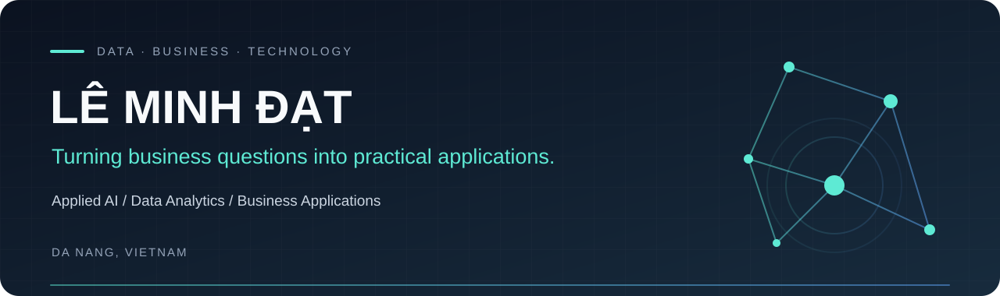

  

  <b>Data Science &amp; Business Analytics graduate · MBA student · Da Nang, Vietnam</b>

  Exploring how data and AI can turn everyday business questions into useful applications.

  <a href="#selected-work">Explore my work</a> &nbsp; / &nbsp;
  <a href="#toolkit">My toolkit</a> &nbsp; / &nbsp;
  <a href="https://github.com/bigbaboy?tab=repositories">All repositories</a>

---

### A little about me

Hi, I'm **Đạt**. I work at the intersection of **business understanding, data analysis and applied AI**.

- 🎓 Graduated in **Data Science and Business Analytics** at the University of Economics — The University of Danang; currently pursuing an **MBA**.
- ⚡ Independently proposed and built an **electricity advisory chatbot prototype** during my graduation project and business department internship.
- 📊 My academic work includes **sales dashboards, customer segmentation and menu personalization**.
- 🌱 Interested in deepening my skills in **RAG evaluation, reliable data pipelines and requirements documentation**.
- 🤝 Interested in **internship and entry-level opportunities** in applied AI, data analytics and technology-focused business analysis.

### Selected work

<table>
<tr>
<td width="50%" valign="top">
<h3>01 · Electricity RAG Chatbot</h3>

<b>Individual graduation project</b>

A Vietnamese document assistant with source references, electricity billing calculations, appliance consumption analysis and solar estimates.

I proposed the topic, documented the scope and flows, and implemented the prototype. Numerical calculations run in Python separately from generated answers.

<code>Python</code> <code>Streamlit</code> <code>LangChain</code> <code>FAISS</code> <code>Groq API</code>

<a href="https://github.com/bigbaboy/danang-electricity-rag-chatbot"><b>Explore project →</b></a> · <a href="https://github.com/bigbaboy/danang-electricity-rag-chatbot/blob/main/docs/architecture.md">Architecture</a>

</td>
<td width="50%" valign="top">
<h3>02 · Sales Analytics</h3>

<b>Academic web application</b>

A CSV-to-dashboard workflow connecting relational data models, analytical queries and interactive sales visualizations.

Explore revenue by product and time period, product-group purchase patterns and customer purchase frequency.

<code>Python</code> <code>Django</code> <code>SQLite</code> <code>D3.js</code>

<a href="https://github.com/bigbaboy/sales-analytics-django-sqlite"><b>Explore project →</b></a> · <a href="https://github.com/bigbaboy/sales-analytics-django-sqlite/blob/main/docs/data-model.md">Data model</a>

</td>
</tr>
<tr>
<td width="50%" valign="top">
<h3>03 · Menu Personalization</h3>

<b>Three-person academic project</b>

A restaurant prototype that uses behavioral features and KMeans to explore customer segments and menu suggestions.

Contributed to the team deliverable, which places recommendations across five menu zones and visualizes segment distributions.

<code>Python</code> <code>pandas</code> <code>scikit-learn</code> <code>Streamlit</code> <code>Plotly</code>

<a href="https://github.com/bigbaboy/customer-segmentation-menu-personalization"><b>Explore project →</b></a> · <a href="https://github.com/bigbaboy/customer-segmentation-menu-personalization/blob/main/docs/flow.md">Implementation flow</a>

</td>
<td width="50%" valign="top">
<h3>04 · Superstore Dashboard</h3>

<b>Academic team project</b>

A business dashboard exploring sales, profitability, purchase frequency, discounts and returns.

The team deliverable connects commercial questions with descriptive visualizations across products, locations and customer segments.

<code>Django</code> <code>D3.js</code> <code>JavaScript</code> <code>CSV</code>

<a href="https://github.com/bigbaboy/superstore-business-dashboard"><b>Explore project →</b></a>

</td>
</tr>
</table>

These are academic projects and prototypes. Repository documentation describes implementation scope, limitations and individual or team context.

### Toolkit

| Area | Tools and concepts I've used |
| :--- | :--- |
| **Data & analysis** | Python · pandas · SQL · Excel · Google Sheets |
| **Applied AI & ML** | RAG · LangChain · FAISS · LLM APIs · scikit-learn · KMeans |
| **Applications & visualization** | Streamlit · Django · SQLite · D3.js · Plotly · Power BI · Tableau |
| **Planning & collaboration** | Git · GitHub · Draw.io process flows · Figma |

### How I approach a project

**Understand the question → map the workflow → prepare the data → build a prototype → validate and document.**

I'm interested in making the connection between a business problem and a technical solution clear, while being honest about what has been implemented and what still needs work.

---

  <b>Building practical skills, one well-documented project at a time.</b> 
  Lê Minh Đạt · @bigbaboy

